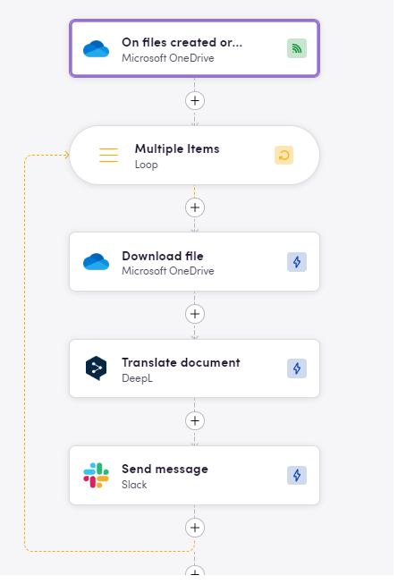

# Blackbird.io Microsoft OneDrive

Blackbird is the new automation backbone for the language technology industry. Blackbird provides enterprise-scale automation and orchestration with a simple no-code/low-code platform. Blackbird enables ambitious organizations to identify, vet and automate as many processes as possible. Not just localization workflows, but any business and IT process. This repository represents an application that is deployable on Blackbird and usable inside the workflow editor.

## Introduction

OneDrive is the Microsoft cloud service that connects you to all your files. It lets you store and protect your files, share them with others, and get to them from anywhere on all your devices.

## Connecting

1. Navigate to apps and search for Microsoft OneDrive.
2. Click _Add Connection_.
3. Name your connection for future reference e.g. 'My organization'.
4. Click _Authorize connection_.
5. Follow the instructions that Microsoft gives you, authorizing Blackbird.io to act on your behalf.
6. When you return to Blackbird, confirm that the connection has appeared and the status is _Connected_.

## Actions

### Storage

- **Upload file to folder** Upload file to specified folder
- **Download file** Download specified file
- **List files in folder** List files metadata in specified folder
- **List changed files** List changed files within specified amount of last hours
- **Get folder metadata** Get information about specific folder
- **Get file metadata** Get information about specific file
- **Create folder in parent folder** Create new folder in another folder
- **Delete folder** Delete specified folder
- **Delete file** Delete specified file

## Polling events

- **On files created or updated** This polling event is triggered when files are created or updated.
- **On folders created or updated** This polling event is triggered when folders are created or updated.
## Examples
 
This bird fetches new or updated files from OneDrive, translates them with DeepL and then sends them to Slack channel

## Feedback

Do you want to use this app or do you have feedback on our implementation? Reach out to us using the [established channels](https://www.blackbird.io/) or create an issue.

<!-- end docs -->
